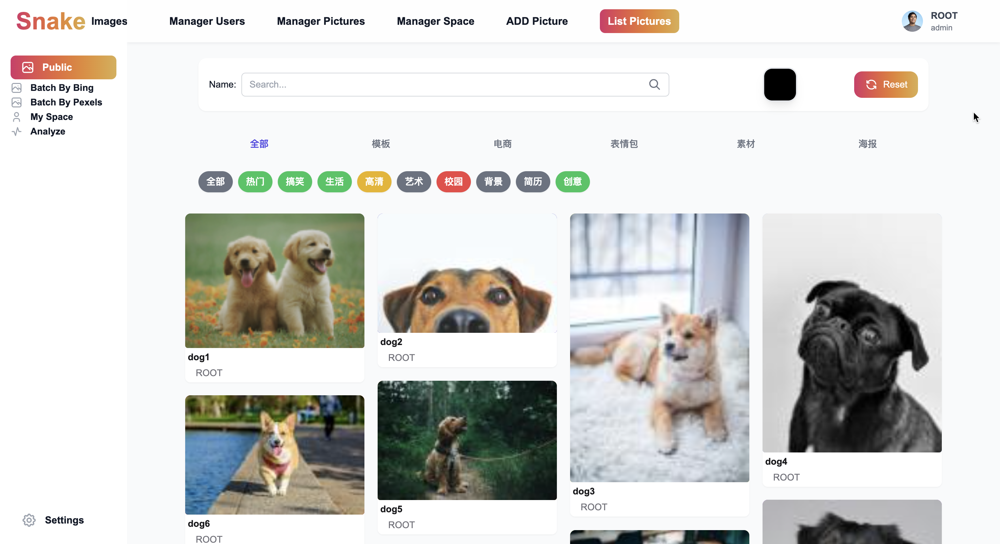
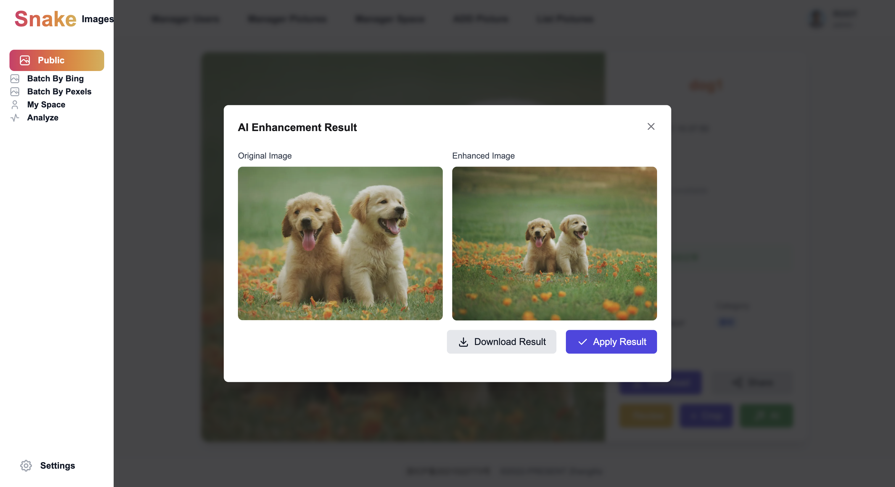
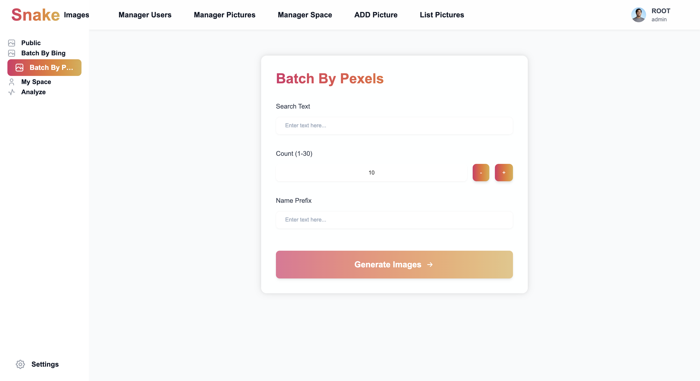
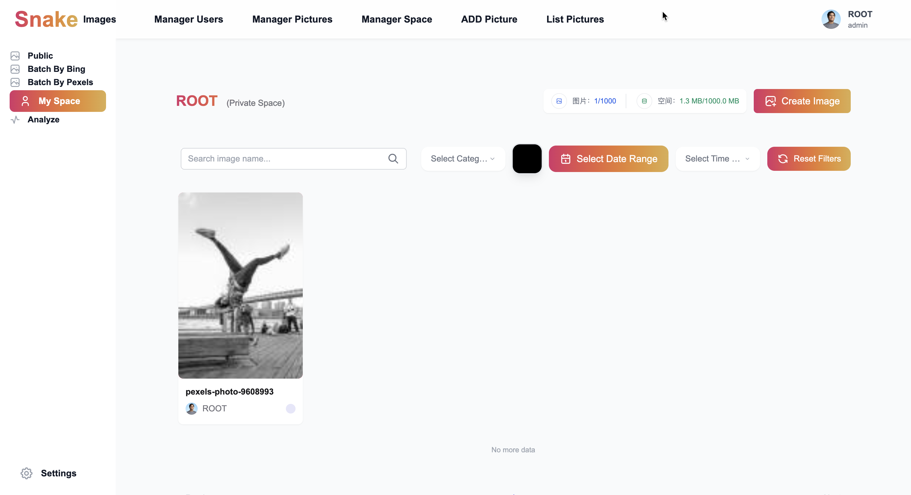
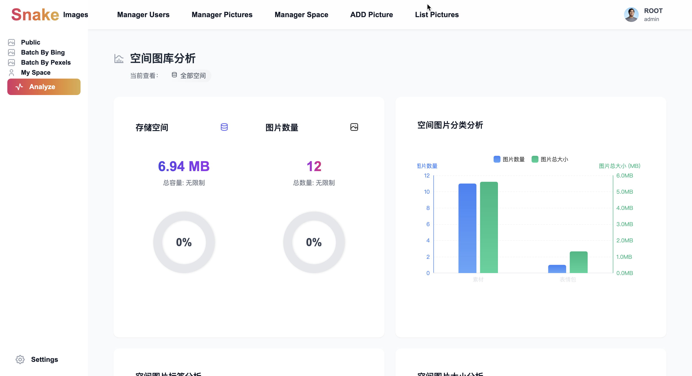

# Snake Picture - Modern Cloud Image Management Platform

[简体中文](./README.md) | English

## Project Overview

Snake Picture is a comprehensive cloud image management system that provides powerful image upload, management, and AI-driven image processing capabilities. The platform combines modern frontend technology with a robust backend architecture to provide users with a seamless image management experience.

## Core Features

1. 📸 **Image Management**

   - File upload and import
   - Batch image operations
   - Image categorization and tagging
   - Public and private image spaces

2. 🤖 **AI Features**

   - Intelligent image processing
   - Image expansion tasks
   - Advanced image analysis

3. 👥 **User Management**

   - User registration and authentication
   - Role-based access control
   - Session management

4. 📊 **Data Analytics**
   - Space usage analysis
   - User activity tracking
   - Category and tag statistics

## Technology Stack

### Frontend

- Vue 3
- TypeScript
- Vite
- Vue Router
- UnoCSS
- Pinia

### Backend

- Spring Boot 2.7.6
- Java 11
- MyBatis-Plus
- Tencent Cloud COS
- Alibaba Cloud AI API

## Project Structure

### Frontend Structure

```
snake-fronted/
├── src/
│   ├── access/      # Access control
│   ├── assets/      # Static resources
│   ├── components/  # Reusable components
│   ├── config/      # Application config
│   ├── layouts/     # Layout components
│   ├── router/      # Route config
│   ├── services/    # API services
│   ├── store/       # State management
│   ├── utils/       # Utility functions
│   └── views/       # Page components
```

### Backend Structure

```
snake-backed/
└── src/main/java/fun/timu/init/
    ├── Application.java
    ├── annotation/
    ├── aop/
    ├── api/
    ├── common/
    ├── config/
    ├── constant/
    ├── controller/
    ├── exception/
    ├── manager/
    ├── mapper/
    ├── model/
    └── service/
```

## Quick Start

### Frontend Development

1. Clone repository
   ```bash
   git clone https://github.com/ZhengKe996/snake-fronted.git
   ```
2. Install dependencies
   ```bash
   npm install
   ```
3. Start development server
   ```bash
   npm run dev
   ```

### Backend Development

1. Clone repository
   ```bash
   git clone https://github.com/ZhengKe996/snake-backed.git
   ```
2. Configure Java environment
3. Import and run project in IDE

## Project Screenshots

### Main Interface


### Image List






### Image Upload and Fetch




### Private Space



### User Center


### Data Analysis




## Contributing

Welcome to submit Pull Requests to help improve the project! Please follow the project's code standards and contribution guidelines.

## License

This project is licensed under the MIT License - see the LICENSE file for details

## Contact

If you have any questions or suggestions, please contact us through GitHub Issues.
