# Snake Picture - 现代云图片管理平台

简体中文 | [English](./README.en.md)

## 项目概述

Snake Picture 是一个全面的云图片管理系统，提供强大的图片上传、管理和 AI 驱动的图像处理功能。该平台结合了现代前端技术和强大的后端架构，为用户提供无缝的图片管理体验。

## 核心功能

1. 📸 **图片管理**

   - 文件上传与导入
   - 批量图片操作
   - 图片分类和标签
   - 公共和私有图片空间

2. 🤖 **AI 功能**

   - 智能图像处理
   - 图像扩展任务
   - 高级图像分析

3. 👥 **用户管理**

   - 用户注册与认证
   - 基于角色的访问控制
   - 会话管理

4. 📊 **数据分析**
   - 空间使用分析
   - 用户活动跟踪
   - 类别和标签统计

## 技术栈

### 前端

- Vue 3
- TypeScript
- Vite
- Vue Router
- UnoCSS
- Pinia

### 后端

- Spring Boot 2.7.6
- Java 11
- MyBatis-Plus
- 腾讯云 COS
- 阿里云 AI API

## 项目结构

### 前端结构

```
snake-fronted/
├── src/
│   ├── access/      # 访问控制
│   ├── assets/      # 静态资源
│   ├── components/  # 可复用组件
│   ├── config/      # 应用配置
│   ├── layouts/     # 布局组件
│   ├── router/      # 路由配置
│   ├── services/    # API 服务
│   ├── store/       # 状态管理
│   ├── utils/       # 工具函数
│   └── views/       # 页面组件
```

### 后端结构

```
snake-backed/
└── src/main/java/fun/timu/init/
    ├── Application.java
    ├── annotation/
    ├── aop/
    ├── api/
    ├── common/
    ├── config/
    ├── constant/
    ├── controller/
    ├── exception/
    ├── manager/
    ├── mapper/
    ├── model/
    └── service/
```

## 快速开始

### 前端开发

1. 克隆仓库
   ```bash
   git clone https://github.com/ZhengKe996/snake-fronted.git
   ```
2. 安装依赖
   ```bash
   npm install
   ```
3. 启动开发服务器
   ```bash
   npm run dev
   ```

### 后端开发

1. 克隆仓库
   ```bash
   git clone https://github.com/ZhengKe996/snake-backed.git
   ```
2. 配置 Java 环境
3. 使用 IDE 导入并运行项目

## 项目效果

### 主界面

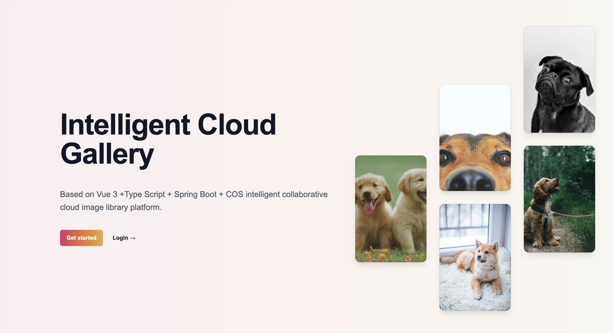


### 图片列表

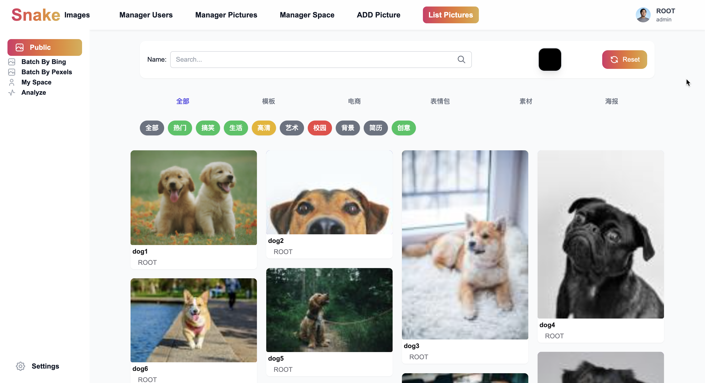

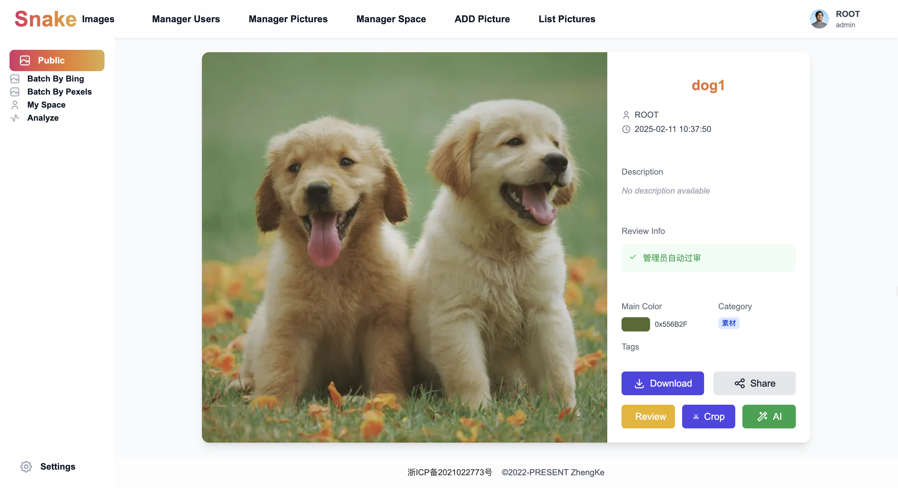
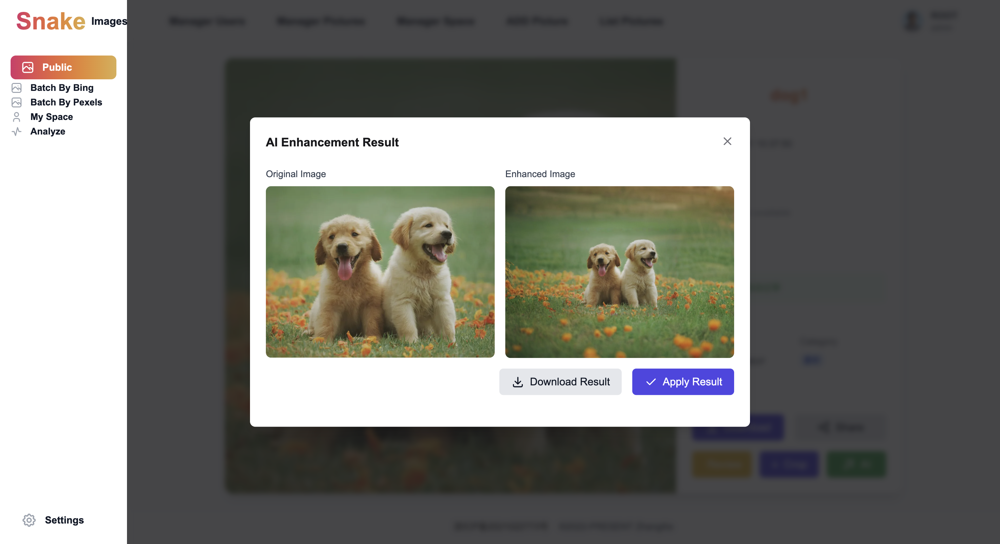

### 图片上传与抓取

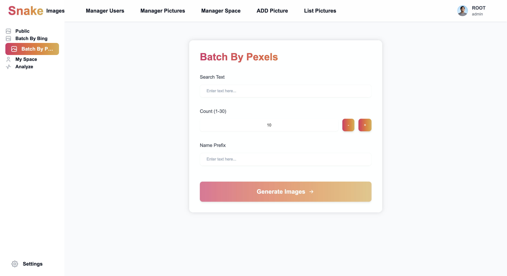
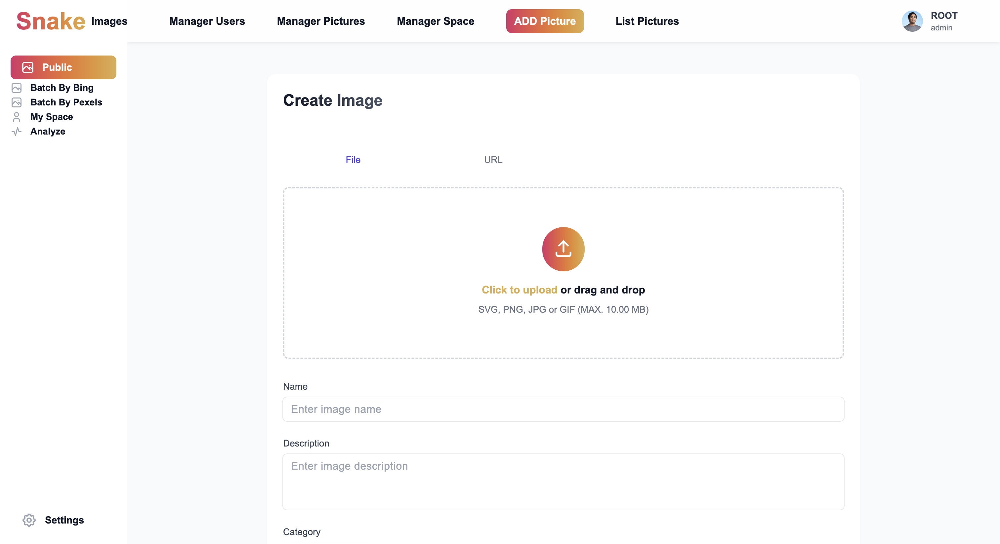

### 私有空间

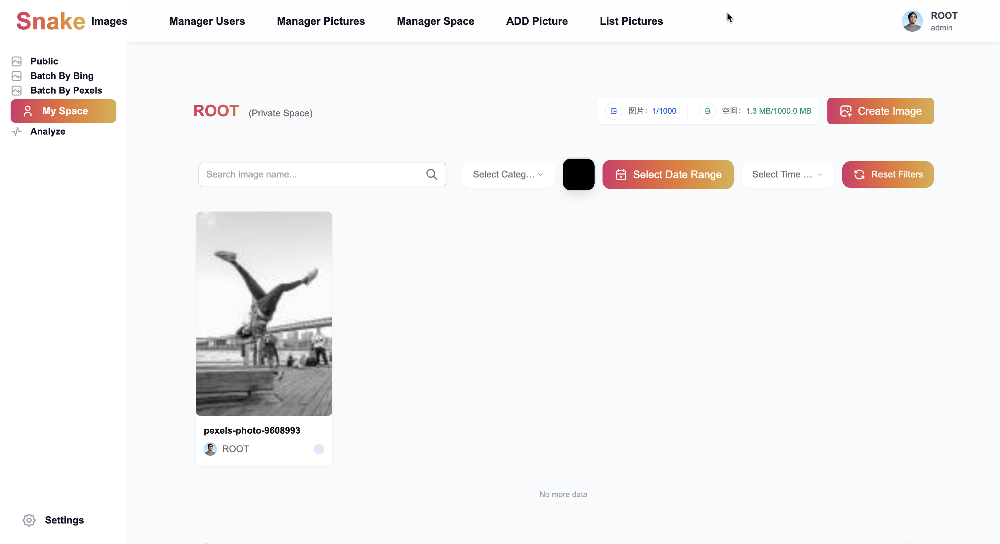

### 用户中心

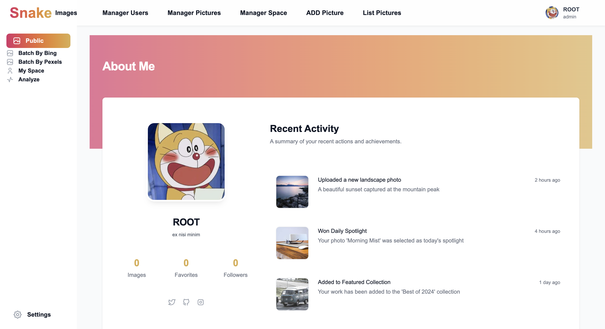
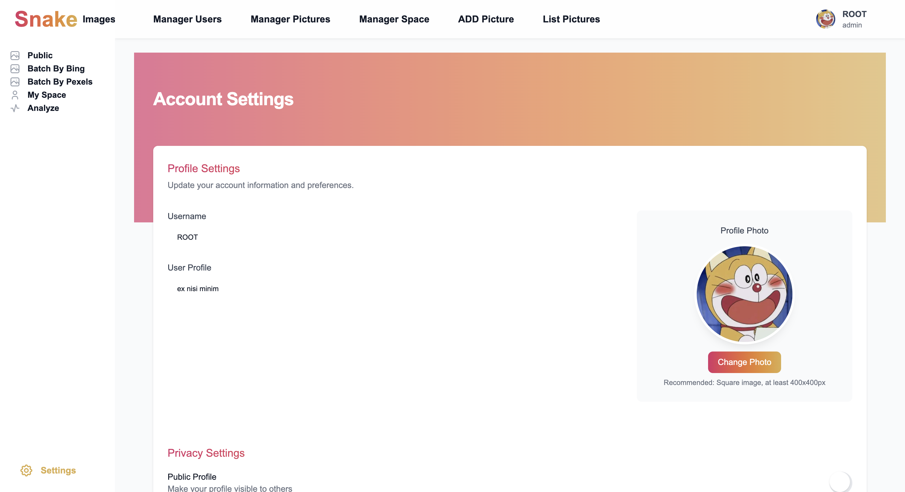

### 数据分析

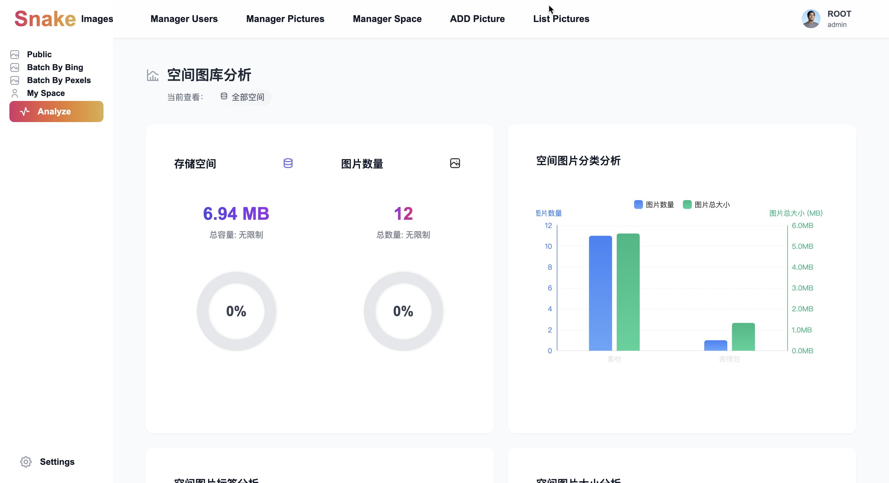
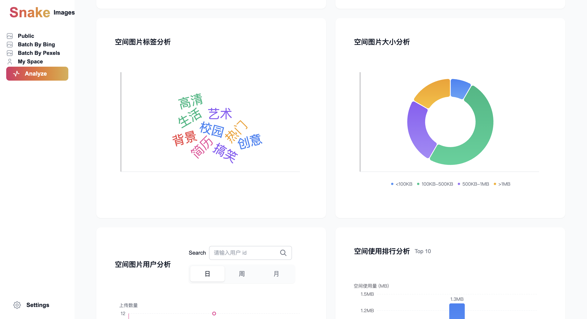

## 贡献

欢迎提交 Pull Request 来帮助改进项目！请遵循项目的代码规范和贡献指南。

## 许可证

本项目采用 MIT 许可证 - 详见 LICENSE 文件

## 联系

如有任何问题或建议，请通过 GitHub Issues 与我们联系。
